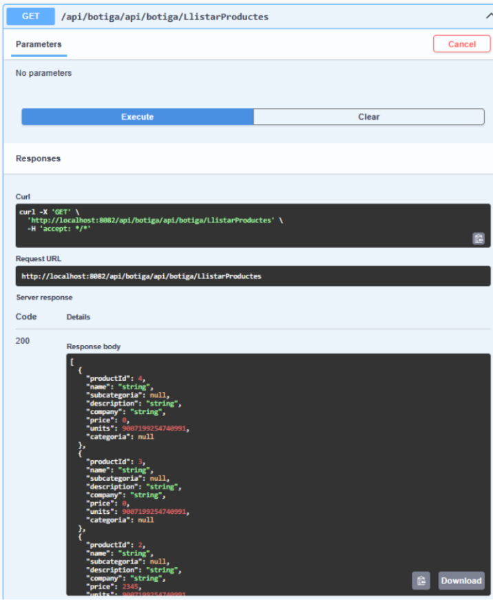
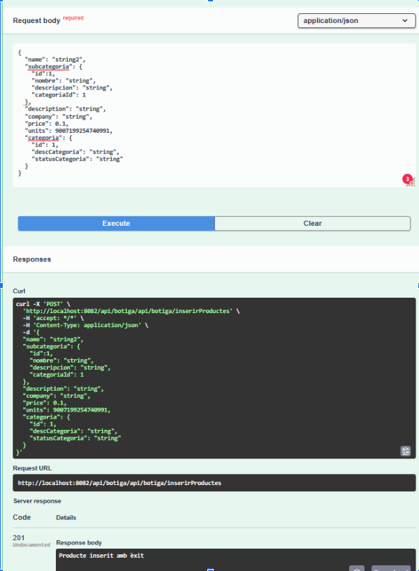
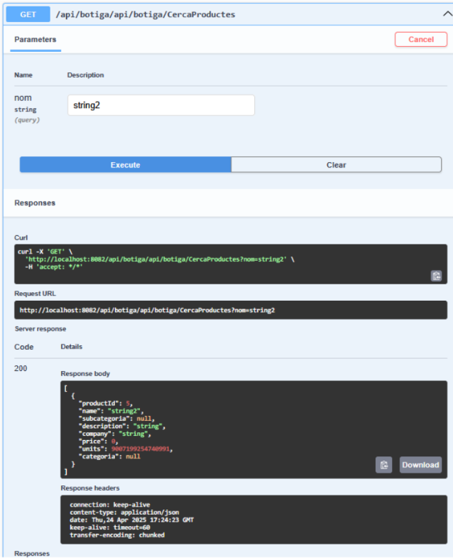
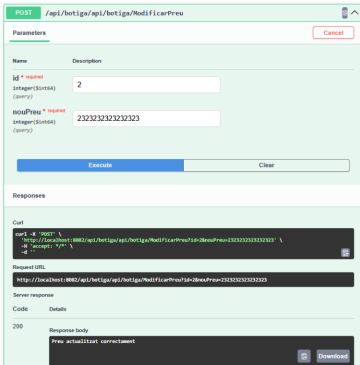
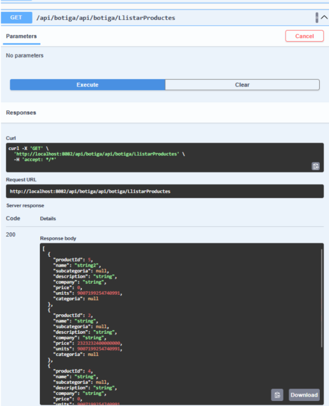
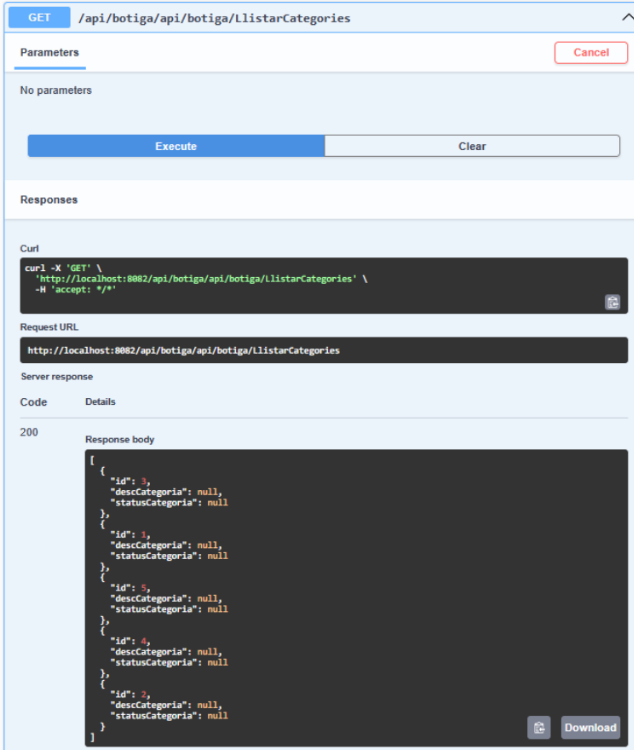
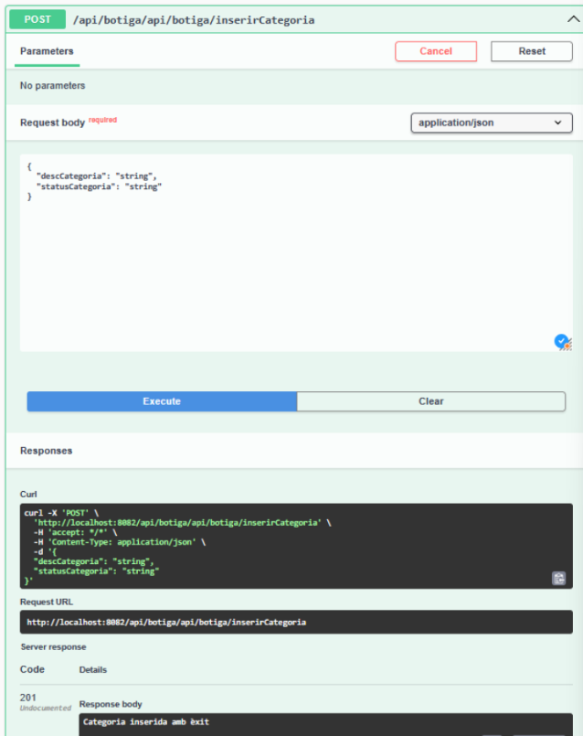
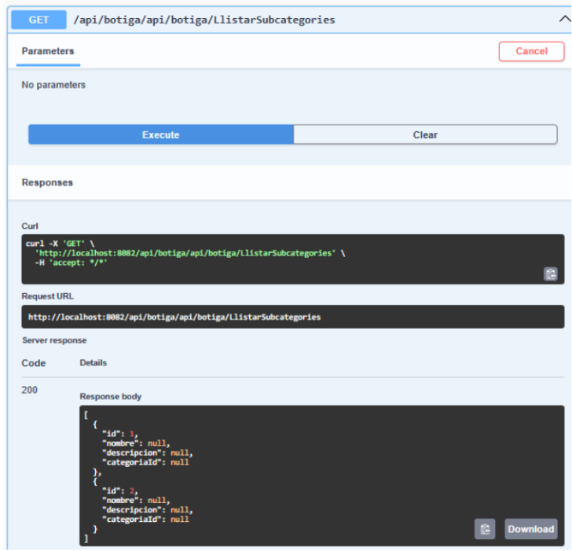
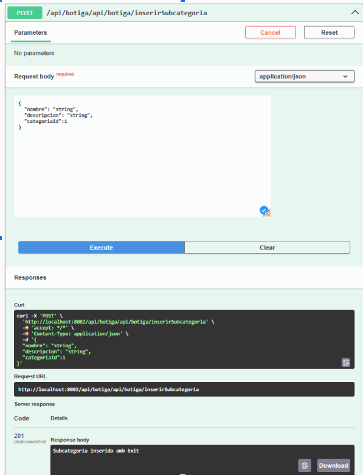

# M06BotigaDTO
## Acosta Daniel, Munoz Karolayn i Segura Alba

Aquest projecte implementa una API REST per gestionar una botiga virtual amb productes, categories i subcategories.

L'aplicació està construïda amb Spring Boot i utilitza una arquitectura en capes seguint el patró DTO (Data Transfer Object) per separar la representació de dades externa de la representació interna.

### Estructura de la Base de Dades
El sistema utilitza una base de dades MariaDB anomenada "Botiga" amb tres taules principals:

- products: Emmagatzema els productes

- categoria: Emmagatzema les categories de productes

- subcategoria: Emmagatzema les subcategories que pertanyen a les categories

### Arquitectura
L’aplicació segueix:

- Controlador: Gestiona les peticions HTTP i retorna respostes

- Servei: Implementa la lògica de negoci

- Repositori: Gestiona l’accés a dades

- DTO: Objectes de transferència de dades entre capes

### Validacions
- Validació de dades: Es valida les dades proporcionades al swagger (com el nom del producte, el preu, etc.).

- Gestió d’errors: Es proporcionen respostes HTTP adequades segons el tipus d’error detectat (com errors de validació, recursos no trobats, etc.).

- Transaccions: S’utilitzen transaccions per assegurar la coherència de les dades en operacions crítiques, com la creació o modificació de productes relacionats amb categories i subcategories.

### Endpoints de l'API
L’API proporciona els següents endpoints:

#### Productes

- GET /api/botiga/LlistarProductes: 

Llista tots els productes, hi han 3 creats amb id 2, 3 i 4

- POST /api/botiga/inserirProducte: 

Insereix un nou producte amb categoria id = 1, subcategoria id = 1 i preu = 0.1

- GET /api/botiga/CercaProductes?nom=...: 

Cerca productes pel nom, en aquest cas String2, muestra el producte nomes amb aquest nom

- POST /api/botiga/ModificarPreu?id=...&nouPreu=...: 

Modifica el preu d’un producte

Preu canviat:

POST /api/botiga/EliminarProducte?id=...: Elimina un producte
GET /api/botiga/LlistarProductesPerCategoria?idCategoria=...: Llista els productes d’una categoria

#### Categories

- GET /api/botiga/LlistarCategories: 

Llista totes les categories, hi han 5 amb id 1, 2 , 3, 4 i 5

- POST /api/botiga/inserirCategoria: Insereix una nova categoria

#### Subcategories

- GET /api/botiga/LlistarSubcategories: 

Llista totes les subcategories, en aquest dues creades amb id 1 i 2.

- POST /api/botiga/inserirSubcategoria: 

Insereix una nova subcategoria con id = 1

GET /api/botiga/LlistarSubcategoriesPerCategoria?idCategoria=...: Llista subcategories d’una categoria
